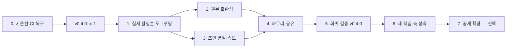

# Movie Desk 마스터플랜

갱신 2026-09-02 · 작업 지침 [`../CLAUDE.md`](../CLAUDE.md) · 기준 문서
[`00-identity.md`](00-identity.md) · 이 문서는 기능
희망 목록이 아니라 **한 편의 영상을 안전하게 완성하기 위한 실행 순서**다.

구체적인 구현 배치와 완료 명령은 [`07-work-order.md`](07-work-order.md)를 따른다.

## 최종 목표

Movie Desk를 **대규모 영상 자산 관리, 전문가 수준의 편집, 초보자를 위한 안내**가
한 작업 공간에서 이어지는 로컬 우선 영상 프로그램으로 완성한다. 사용자는 처음에는
안내와 좋은 기본값으로 결과물을 만들고, 익숙해진 뒤에는 같은 프로젝트에서 정밀한
편집·색·음향·자막·효과·출력까지 수행한다.

첫 검증 마일스톤은 아이폰과 카메라에 쌓인 실제 가족·여행 촬영본 50~200개를 그대로
넣고, 정리 → 선택 또는 검색 → 안내형 초안이나 수동 편집 → 정밀 마무리 → 내보내기 →
공유까지 다른 편집기 없이 끝내는 것이다. 이 마일스톤은 최종 제품의 범위를 제한하지
않으며 세 핵심 축을 실제 작업으로 검증하는 시작점이다.

성공은 기능 개수가 아니라 다음 여섯 가지로 판단한다.

1. 지원하는 원본은 전부 들어오고, 지원하지 못하면 이유와 해결 방법을 알려 준다.
2. 수백~수천 개의 자산을 정리·검색·재연결하고 여러 프로젝트에서 안전하게 재사용한다.
3. 초보자는 다음 행동을 이해하고, 숙련자는 프레임·속성·색·음향·효과를 정밀하게
   제어한다.
4. 안내형 초안을 선택했다면 사용하거나 제외한 장면의 이유를 이해하고 모든 변경을
   되돌릴 수 있다.
5. 다른 편집기를 거치지 않고 재생 가능한 고품질 결과물을 공유한다.
6. 전체 과정에서 충돌·데이터 손실·무응답 중단이 없고 원본이 훼손되지 않는다.

## 2026-09-02 기준선

| 영역 | 확인된 현재 상태 |
| --- | --- |
| 제품 | Movie Desk 정체성·이름·저장소·랜딩 정리 완료. Photo Desk와 Pretendard, 색상, 14/13.5/12/11px UI 위계를 공유한다. |
| 브랜치 | `feat/identity`가 `origin/main`보다 8커밋 앞서며 아직 원격 main에 통합되지 않았다. |
| CI | 원격 main의 마지막 CI는 2026-08-06 실패. 로컬 `pnpm audit:prod`도 postcss 1건과 nanoid 3건을 탐지한다. |
| 검증 | web 237 + core 92 + desktop 14 = 343개 테스트와 Playwright 8개가 통과한다. 1024/1440px 실제 콘텐츠 화면도 확인했다. |
| 릴리스 | 최신 공개판은 이름 변경 전의 미서명 `v0.3.1`이다. Movie Desk 이름의 릴리스는 아직 없다. |
| 입력 | 일반 MP4·이미지·오디오는 동작. HEIC/HEIF, HEVC, `.mov`, 회전 메타, Live Photo는 실사용 검증과 보완이 필요하다. |
| 핵심 품질 | 자동 정리·분석 리포트·5개 모드·초안·채택/제외·음악 흐름이 구현돼 있지만 실제 대규모 촬영본 도그푸딩 기록이 없다. |
| 기술 부채 | `mp4-muxer`가 폐기 예정이고 knip가 미사용 export/type 10개를 보고한다. 장면 감지·모션 추적은 순차 seek라 느리다. |
| 오프라인 | 미디어는 외부로 전송하지 않는다. 다만 FaceLandmarker는 로컬 모델이 없으면 Google에서, Whisper는 첫 사용 시 Hugging Face에서 모델을 받는다. 데스크톱 릴리스의 첫 실행 오프라인성은 별도 검증해야 한다. |

## 실행 원칙

- **세 축을 함께 키운다.** 라이브러리·전문 편집·안내와 보조 중 하나를 부속 기능으로
  취급하지 않는다.
- **단계적 공개로 쉽게 만든다.** 초보자의 길을 분명하게 하되 전문 기능을 제거하거나
  낮은 상한을 만들지 않는다.
- **도그푸딩이 로드맵보다 우선.** 실제 작업에서 나온 P0/P1 문제가 계획을 바꿀 수
  있다.
- **작은 수직 조각으로 끝낸다.** 구현, 테스트, 실제 화면 확인, 문서, 커밋을 한
  단위로 묶는다.
- **안정판은 검증 뒤에 낸다.** Phase 0에서는 RC만 만들고 `v0.4.0` 안정판은
  도그푸딩과 릴리스 게이트를 통과한 뒤 만든다.
- 크기 표기: S = 반나절~하루, M = 2~4일, L = 1~2주.

## 전체 흐름

## Phase 0 — 기준선과 릴리스 후보 만들기 (S~M)

목표: 현재 Movie Desk를 안전하게 통합하고 이후 도그푸딩이 재현 가능한 상태를 만든다.

- OSV 취약점 4건을 호환 버전으로 해결하고 `pnpm audit:prod`를 녹색으로 만든다.
- root/web/core/desktop 버전 정책을 하나로 정한다. 릴리스 버전의 단일 기준은
  `apps/desktop/package.json`으로 명시하거나 전체를 동기화한다.
- `feat/identity`를 최신 main 기준으로 검증한 뒤 PR 또는 fast-forward로 통합하고
  원격 CI를 통과시킨다.
- 남은 knip 10건과 포맷 차이는 동작 변경과 분리한 정리 커밋으로 처리한다.
- arm64/x64 `v0.4.0-rc.1` DMG를 만들고 앱 이름, 아이콘, 설치 배경, 업데이트 확인,
  기존 프로젝트 마이그레이션을 확인한다.
- 첫 실행 오프라인 검사를 추가한다. Whisper와 FaceLandmarker 모델이 릴리스 번들에
  실제 포함되는지 확인하고, 없으면 다운로드 상태를 정직하게 안내한다.

완료 게이트:

- main CI 전체 녹색: lint, typecheck, 343 tests, audit, build, E2E 8+.
- RC DMG가 Apple Silicon과 Intel에서 실행되고 기존 `cut_editor` 저장 데이터를 연다.
- 안정판 태그는 아직 만들지 않는다.

## Phase 1 — 실제 영상 한 편 도그푸딩 (M)

목표: 추측이 아닌 실제 막힘으로 이후 순서를 확정한다.

- 최근 여행 또는 가족 촬영본 50~200개를 고른다. HEIC, HEVC, `.mov`, 세로 영상,
  사진, 음악을 의도적으로 섞는다.
- 다음 여정을 중단 없이 밟는다: 가져오기 → 자동 정리 → 분석 리포트 → 모드/길이
  선택 → 초안 → 채택/제외 → 타임라인 마무리 → 내보내기 → 가족 전송.
- `docs/dogfood/YYYY-MM-DD.md`에 기기, 파일 구성, 총 소요 시간, 분석 시간, 막힌
  지점, 이해 못 한 문구, 교체한 컷과 이유를 기록한다.
- 문제를 P0(완주 불가/손실), P1(결과 신뢰 저하), P2(불편), 아이디어로 분류한다.

완료 게이트:

- 3~5분짜리 완성본 한 편을 실제로 전송한다.
- P0 문제 0개. P1 목록과 측정 기준선이 남는다.
- 초안 유지율, 가져오기 성공률, 초안 생성 시간, 수동 개입 횟수를 기록한다.

## Phase 2 — 아이폰·카메라 원본 그대로 받기 (M~L)

목표: 변환 도구 없이 원본을 넣는 첫 관문을 닫는다. Phase 1의 입력 P0/P1만 먼저
처리한다.

- HEIC/HEIF 썸네일·프레임 디코드와 EXIF 촬영 시각/위치 유지.
- HEVC(H.265)와 `.mov`의 재생·분석·내보내기 경로 및 WebCodecs 지원 분기.
- 세로 영상 회전 메타, Live Photo의 정지/영상 쌍, 폴더 재귀와 DCIM 구조.
- 코덱 미지원, 손상 파일, 저장 공간 부족을 서로 다른 오류로 안내하고 재시도 경로를
  제공한다.
- 가져오기 호환 표와 소형 고정 fixture를 만들어 CI에서 회귀 검증한다.

완료 게이트:

- 기준 촬영본의 모든 파일이 들어오거나 파일별로 실행 가능한 해결 안내가 나온다.
- 촬영 시각·방향·장소가 Photo Desk와 같은 기준으로 보존된다.
- 실패한 한 파일 때문에 나머지 일괄 가져오기가 중단되지 않는다.

## Phase 3 — 초안 품질과 분석 속도 (L)

목표: 자동 편집 결과를 “다시 만들기”가 아니라 “마무리하기” 시작점으로 만든다.

- 분석 리포트를 비전문가 언어로 다시 쓴다. 수치보다 무엇이 있고 어떤 영상이 가능한지
  먼저 보여 준다.
- 채택·탈락 이유를 얼굴, 흔들림, 노출, 중복, 골든아워, 이야기 위치처럼 한 줄로
  설명한다.
- 성장 기록은 인물 중심 세트로 별도 검수하고 얼굴/미소/시간 흐름 가중치를 조정한다.
- 사진+영상 혼합, 음악 없는 모드, 짧은 소스, 중복이 많은 소스를 고정 시나리오로
  검증한다.
- 장면 감지와 모션 추적이 재생용 WebCodecs 디코더를 공유하도록 바꿔 순차 seek를
  제거한다. 대용량 분석에는 진행률, 취소, 재개 또는 안전한 재실행을 제공한다.
- 자동 편집 E2E를 추가해 추천 → 초안 생성 → 한 번에 실행취소까지 검증한다.

완료 게이트:

- 두 번째 도그푸딩에서 초안 유지율 60% 이상.
- 동일 장비·동일 fixture에서 분석 시간을 기준선보다 단축하고 수치를 문서에 남긴다.
- 모든 자동 결정이 이유를 갖고, 채택/제외와 실행취소를 지킨다.

## Phase 4 — 마무리와 공유를 한 흐름으로 만들기 (M)

목표: 결과물을 만든 뒤 다른 도구를 찾지 않게 한다.

- 여행/성장 기록용 제목·챕터 카드 2~3종과 한글 폰트 프리셋.
- 한국어 Whisper 모델의 품질·크기·속도를 비교하고 데스크톱 번들 정책을 결정한다.
- 가족 메신저(용량 우선), YouTube, TV·태블릿용 내보내기 프리셋을 실제 재생기로
  검증한다.
- 내보내기 완료 화면에서 파일 위치 열기, 다시 내보내기, 다음 공유 행동을 연결한다.
- 프로젝트 백업/복원과 미디어 누락 복구 안내를 UI에서 찾을 수 있게 한다.

완료 게이트:

- Movie Desk만으로 제목·자막·음악·화면비·음량까지 마무리한다.
- 내보낸 파일이 목표 기기/서비스에서 영상·스테레오 음성·자막과 함께 재생된다.

## Phase 5 — 신뢰성 게이트와 `v0.4.0` (M)

목표: 도그푸딩에 성공한 흐름을 회귀 테스트와 릴리스로 고정한다.

- 자동 편집, 취소, 복원, 내보내기 스모크를 Playwright 또는 브라우저 fixture로
  자동화한다.
- `mp4-muxer`를 유지보수되는 후속 라이브러리로 교체하고 MP4/오디오/프록시/지도
  전환 출력을 비교 검증한다.
- 충돌 복구, 저장 공간 부족, 손상 프로젝트, 누락 미디어를 릴리스 체크리스트에 넣는다.
- arm64/x64 DMG에서 첫 실행, 기존 프로젝트, 업데이트 안내, 오프라인 분석과 내보내기를
  다시 확인한다.
- `v0.4.0` 태그와 Movie Desk 이름의 첫 안정 릴리스를 만든다.

완료 게이트:

- CI와 릴리스 체크리스트 전체 녹색.
- 서로 다른 실제 촬영본 두 세트가 끝까지 완주한다.
- 알려진 데이터 손실·완주 차단 문제가 없다.

## Phase 6 — 세 핵심 축을 제품 수준으로 성숙시키기 (장기, 반복)

목표: 첫 안정판에서 확인한 완주 흐름을 대규모 자산과 전문 작업까지 확장한다. 아래
세 트랙은 순차 기능 목록이 아니라 함께 성장시킬 제품 축이다.

### A. 영상 라이브러리

- 참조·복사·관리형 가져오기 정책과 원본 위치를 사용자가 이해할 수 있게 한다.
- 코덱·프레임률·카메라·렌즈를 포함한 메타데이터 인덱스와 빠른 복합 검색을 만든다.
- 폴더와 별개인 컬렉션, 태그, 평점, 즐겨찾기, 사용 여부, 스마트 필터를 제공한다.
- 중복·유사 장면 검토, 누락 미디어 재연결, 프록시 상태, 휴지통과 안전한 정리를
  완성한다.
- 자산을 복제하지 않고 여러 프로젝트에서 재사용하며 수천 개 규모에서 성능을
  측정한다.

### B. 전문 편집과 성능

- 모든 중요한 속성에 프레임·시간·수치 기반 정밀 입력과 일관된 키프레임 제어를
  제공한다.
- 피치 보존 속도 변경, 중첩 시퀀스, 컬러 관리·스코프, 오디오 미터·버스·믹싱처럼
  실제 작업에서 다른 편집기를 찾게 만드는 공백을 우선 메운다.
- 고해상도·긴 타임라인·다중 트랙에서 프록시, 캐시, 백그라운드 처리와 GPU/워커
  경계를 측정해 결정한다.
- 다양한 입출력 코덱, 색 공간, 프레임률, 오디오 구성의 품질과 동기화를 fixture와
  실제 재생기로 검증한다.

### C. 안내와 학습 가능한 인터페이스

- 새 프로젝트에서 가져오기·정리·수동 편집·안내형 초안 중 가능한 출발점을 명확히
  보여 준다.
- 빈 화면, 선택 상태, 오류 상태마다 현재 상황과 다음 행동을 짧게 설명한다.
- 기본 조작에서 정밀 조작까지 같은 화면 안에서 단계적으로 드러내고, 기능을 가리는
  별도 장난감 모드는 만들지 않는다.
- 안내의 성공 여부를 기능 클릭 수가 아니라 첫 완성률, 도움 없이 복구한 비율,
  숙련 사용자의 작업 속도로 검증한다.

완료 게이트:

- 실제 혼합 자산 1,000개 이상을 가져와 정리·검색·재연결하고 여러 프로젝트에서
  재사용할 수 있다.
- 처음 쓰는 사용자가 설명 없이 짧은 결과물을 완성하고, 숙련 사용자가 같은 프로젝트를
  이어받아 정밀하게 마무리할 수 있다.
- 일반적인 개인·독립 제작 작업에서 파일 정리나 최종 마무리를 위해 다른 편집기로
  이동해야 하는 핵심 공백이 없다.

## Phase 7 — 공개 확장 (사용자가 생길 때만)

- Apple Developer ID 서명·공증, 상표·도메인 확인, 개인정보/오픈소스 고지.
- 처음 쓰는 사람 3명에게 설명 없이 과제를 주고 관찰한다.
- 영어 랜딩과 온보딩은 한국어 여정이 안정된 뒤 진행한다.
- 새 대상군이 생기면 [`00-identity.md`](00-identity.md)의 “누구를 위한 것인가”를
  먼저 바꾼 뒤 기능을 추가한다.

## 계속 측정할 지표

| 지표 | 첫 기준선 | 목표 |
| --- | --- | --- |
| 가져오기 성공률 | Phase 1에서 측정 | 기준 세트 100% 또는 파일별 해결 안내 |
| 첫 초안까지 시간 | Phase 1에서 측정 | Phase 3에서 기준선 대비 단축 |
| 초안 유지율 | Phase 1에서 측정 | 60% 이상 |
| 완주 차단 문제 | Phase 1에서 측정 | 안정 릴리스 시 0 |
| 자동 편집 수동 개입 | Phase 1에서 측정 | 2회차에서 감소 |
| 데이터 손실 | 0 | 항상 0 |

## 당장 실행할 10개

1. postcss·nanoid 취약 의존성을 갱신하고 `pnpm audit:prod` 통과.
2. knip 10건과 포맷 차이를 동작 변경과 분리해 정리.
3. 패키지 버전 정책 확정 후 `0.4.0-rc.1` 준비.
4. `feat/identity` 통합 및 원격 CI 녹색 확인.
5. RC arm64/x64 DMG 설치·업데이트·기존 데이터 호환 확인.
6. 도그푸딩 촬영본 1세트 선정과 기록 템플릿 생성.
7. 한 편을 끝까지 만들어 P0/P1 목록과 성능 기준선 기록.
8. 도그푸딩에서 확인된 입력 호환 P0부터 수정.
9. 자동 편집 전체 여정 E2E와 내보내기 스모크 추가.
10. 두 번째 도그푸딩을 통과한 뒤 `v0.4.0` 안정 릴리스.

## 지금 하지 않을 것

실시간 팀 협업, 플러그인 마켓, 클라우드 계정·필수 업로드, 자동 편집만으로 끝나는
제품, 대량 숏폼 생성기, 모바일 네이티브 셸.

WebGPU, 렌더 워커, 중첩 시퀀스, 백그라운드 렌더 큐는 비목표가 아니라 성능·전문
작업 검증 결과에 따라 순서를 정할 구현 수단과 고급 기능이다. 색·오디오 포스트는
전문 편집 목표의 일부이며, 모든 전문 툴을 그대로 복제하기보다 실제 완성 작업에
필요한 깊이부터 확장한다. 공개용 서명·공증은 개인 사용 단계의 완주 품질보다 앞서지
않는다.

## 갱신 규칙

각 Phase가 끝날 때 이 문서의 기준선, 지표, 당장 실행할 목록을 갱신한다. 새 기능을
넣으려면 어느 성공 지표를 개선하는지 한 문장으로 설명할 수 있어야 한다. 설명할 수
없으면 백로그가 아니라 주차장에 둔다.
