# A4 후속 — 데스크톱 재연결·카탈로그 백업/복원

- 날짜: 2026-09-06, macOS 26.6.2 arm64, Electron 43.1.1, Node 22.19.0.
- 브랜치: `codex/a4-desktop-relink`, base `07d5d33`.
- 범위: disk 참조 파일·폴더 재연결, 볼륨 복귀 감지, SQLite 카탈로그 스냅샷·확인 복원.
- 실행: 실제 Electron 프로세스 + production renderer를 격리 프로필에서 실행했다. 페이지 조작·검사는 Playwright/CDP, 네이티브 파일·폴더·복원 대화상자는 Computer Use로 수행했다. 자동화가 보조한 실기 검증이며 서명된 RC DMG 검증은 아니다.

## 구현 계약 (리뷰 반영 후)

원본 경로와 후보 파일은 메인 프로세스에 남는다. 렌더러에는 15분 만료·sender 소유의 선택 토큰, 상대 경로, 크기와 지문 판정만 전달한다. helper `inspect` 및 `fingerprint`로 검사하고, 적용 직전에 파일·카탈로그가 바뀌지 않았는지 재검사한다. 동일 크기만으로 동일 파일로 간주하지 않는다. 기존 full hash가 있으면 full, 그 외 quick hash를 비교하며 지문이 없거나 다르면 확인이 필요하다.

폴더는 정확한 상대 경로만 매칭한다. basename·유사 이름·대소문자 추측을 하지 않으며 경로 이탈과 symlink escape를 거부한다. 목록에 동일/다른 지문/사용 불가를 보여주고 사용자가 확인한 행만 순차 적용한다. 실패 행은 성공으로 표시하지 않으며 다시 선택할 수 있다. 새 root에서도 하위 상대 경로 구조를 유지한다.

재연결 후 sourceRef와 프로젝트 record를 갱신하고 기존 lease, preview store 메모리 캐시를 무효화한다. 다른 파일이면 앱 소유 프록시·오디오 파생 파일을 버리고 기존 재연결의 preview 생성기를 재사용한다. 저장 실패 시 `previewsStored`와 stale-row 삭제·`forget` 계약을 유지한다. HEIC 편집용 JPEG의 리사이즈 크기가 원본 사실을 덮어쓰지 않도록 helper의 width/height를 우선한다.

화면이 보이는 동안 30초마다 health를 재검사하며 기존 focus/visibility 검사도 유지한다. 같은 volume UUID/상대 경로가 복귀하면 source resolver를 다시 사용하고 source root의 현재 경로와 상태를 카탈로그에 기록한다.

카탈로그 schema v2는 `asset_source_state`를 추가한다. worker가 무결성 확인 후 `VACUUM INTO`로 일관된 스냅샷을 만들며, 앱 데이터 `catalog/backups/`에 최근 3개·시간별 2개·일별 2개를 합쳐 최대 7개를 유지한다. 15분 간격으로 변경 여부를 확인해 변경 시 생성하고, 종료 시 최근 5분 내 백업이 없으면 4초 상한 안에서 생성하며 File 메뉴에서도 수동 백업할 수 있다. 손상/열기 실패 시 복원을 제안한다. 사용자가 스냅샷을 선택하고 다시 확인해야 복원하며, 이전 DB/WAL/SHM을 `media.sqlite3.before-restore-<uuid>/`에 보존한다. 복원 실패 시 이전 파일을 되돌리고 복구 안내를 표시한다. 원본 미디어와 프로젝트 파일은 백업 대상이나 덮어쓰기 대상이 아니다.

## 검증

| 항목 | 결과 |
| --- | --- |
| `pnpm gate` | PASS: frozen install, versions, lint, typecheck, unit, OSV, production build, browser install, e2e |
| 데스크톱 단위 | 72/72 PASS (`pnpm --filter @movie-desk/desktop test`) |
| Core 단위 | 107/107 PASS |
| 렌더러 단위 | 506/506 PASS: 기존 relink 판정·preview 실패 계약, 정확한 일괄 매칭, HEIC 원본 크기 보존 포함 |
| scripts 단위 | 11/11 PASS |
| 웹 e2e | 49/49 PASS: `relink-trash.spec.ts`에 desktop bridge mock의 동일 크기/다른 지문 확인 흐름 추가 |
| 기존 원본 보존 | 임시 볼륨 원본 2개와 동일 후보 사본들의 SHA-256 일치 |
| i18n | 기존 en/ko 8개 키에 리뷰 안내 10개씩 append-only 추가, 기존 4칸 포맷 유지 |

데스크톱 단위에는 동일 크기/다른 bytes, 명시적 확인, sender가 다른 토큰·재사용 토큰 거부, 후보 선택 후 변경 거부, 폴더 누락·symlink 이탈, 하위 상대 경로 보존, WAL 스냅샷의 사용자 메모 보존, 확인 없는 복원 거부, 손상 스냅샷 거부, 백업 실패 시 정상 스냅샷 보존이 포함된다.

## 최초 실기 시나리오 (a921ae1)

조정자가 전용 임시 APFS 볼륨 검증을 승인했다. `/tmp/movie-desk-a4.M6Cyqq/`에 128MB sparse image와 격리 profile을 만들고, `/Volumes/MovieDeskA4Test`만 연결·해제했다. PHOTO, ROON, T7 등 기존 사용자 볼륨에는 쓰기나 마운트 해제를 하지 않았다.

| 순서 | 조작·관찰 | 결과 |
| --- | --- | --- |
| 1 | 임시 APFS 볼륨의 HEIC 2개를 실제 importer로 참조 가져오기 | 카드 2개, 누락 배지 없음 |
| 2 | 전용 임시 볼륨 해제 | 당시 10초 health 검사에서 Missing 2개, 누락 안내·재연결 버튼 표시 |
| 3 | 같은 디스크 이미지를 같은 UUID로 재연결 | 수동 후보 선택 없이 Missing 0개로 자동 복구 |
| 4 | 다시 볼륨 해제 → 카드 Relink → 네이티브 chooser에서 동일 사본 선택 | 해당 카드만 복구, 나머지 Missing 1개 |
| 5 | 격리된 테스트 참조의 위치를 바꿔 2개 누락 상황 재현 → 폴더 지정 | 상대 경로 2개와 지문 판정이 적용 전에 표시됨 |
| 6 | 동일 후보 1개 + 테스트용으로 다시 인코딩한 다른 후보 1개를 미리보기에서 확인·연결 | 두 행 Connected, Missing 0개, 원본 크기 및 파생 미리보기 갱신 |
| 7 | File 메뉴의 백업 동작 실행 및 정상 종료 | 수동·종료 스냅샷 각각 생성, 파일 약 61KB |
| 8 | 앱 종료 후 격리된 catalog DB만 의도적으로 손상 → 재실행 | 복원 제안 표시, Continue 후 손상 bytes 동일 |
| 9 | File 복원 → 저장된 스냅샷 선택 → 별도 Restore and restart 확인 | 앱 자동 재시작, `quick_check=ok`, 자산 2개·source state online 2개 |
| 10 | 복원 전 보존 폴더 확인 | 의도적으로 손상시킨 bytes가 그대로 보존됨 |
| 11 | 최종 renderer에서 다른 3×3 HEIC 파일을 네이티브 chooser로 지정 → Relink anyway | 확인 전 경고 표시, 확인 후 Missing 0개 및 원본 3×3 치수 유지 |

원본/동일 후보의 검증 SHA-256: `ea1ea84f0270629fbcaa4dc732493105fddddf54c2e03ff35f3eeda2e13241a0`.

실기에서 발견한 두 문제를 수정했다: 프로젝트의 실제 색상 토큰을 사용해 일괄 대화상자를 불투명하게 표시했고, HEIC의 4096px 편집용 preview 치수가 원본 치수를 덮어쓰지 않게 했다. 후자는 전용 렌더러 회귀 테스트로 고정했다.

## 스크린샷

정상 참조 및 볼륨 분리·복귀:

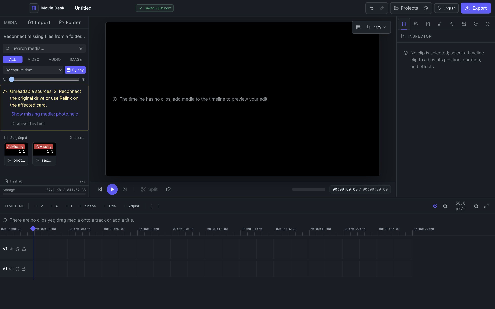
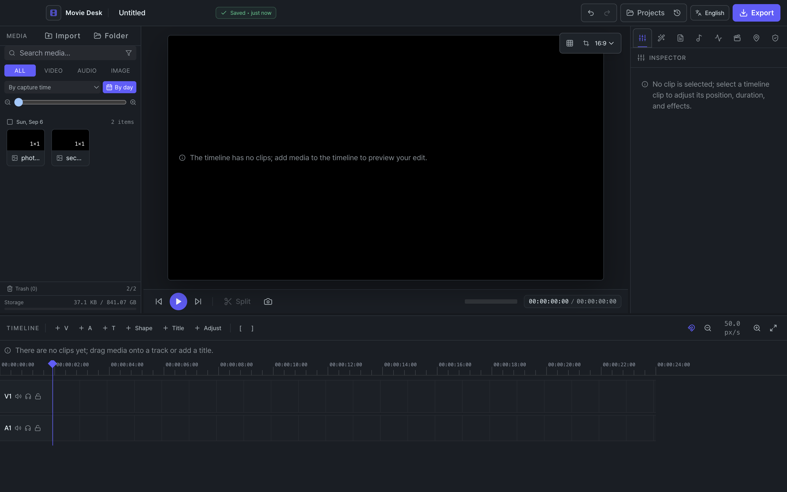

파일 지정 및 폴더 일괄 확인:

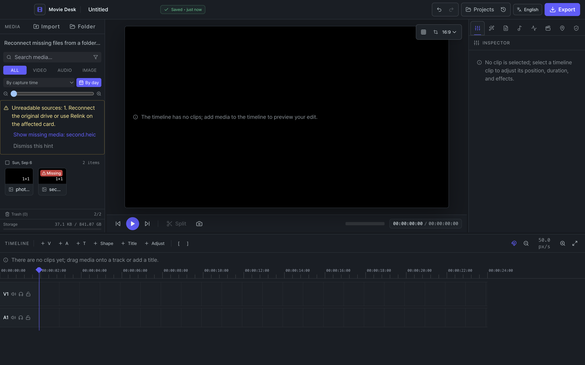
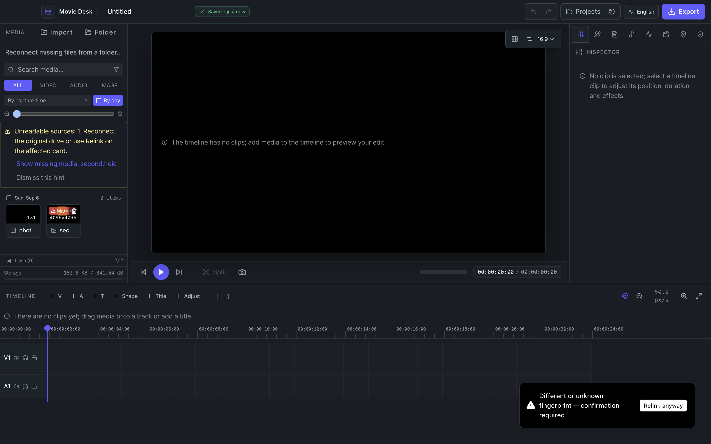
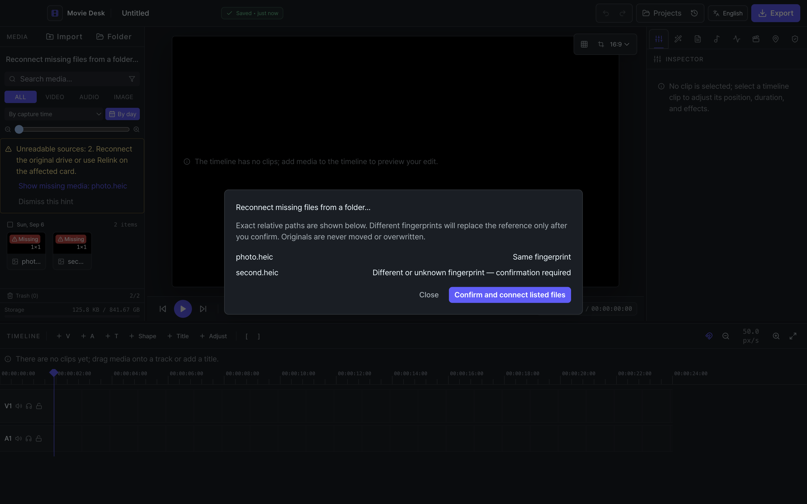
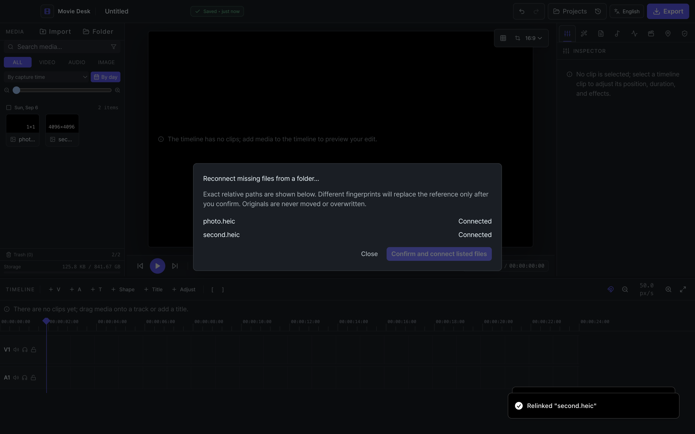

손상 제안·복원 확인·복구:

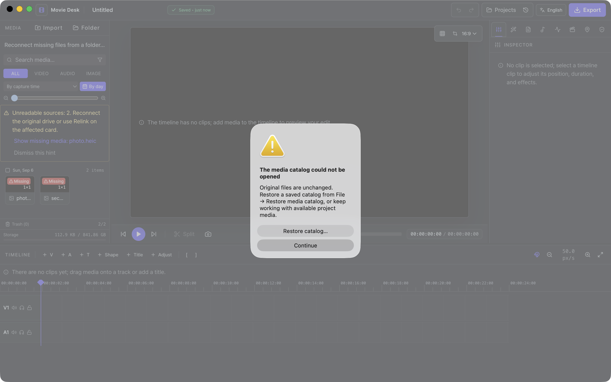
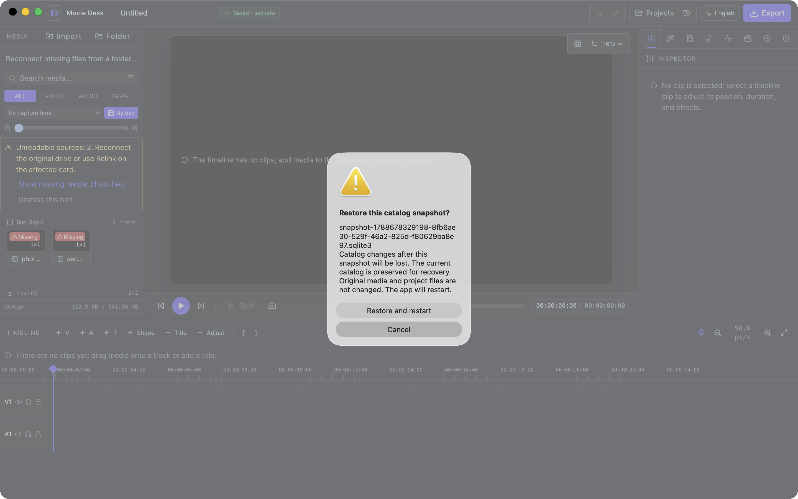

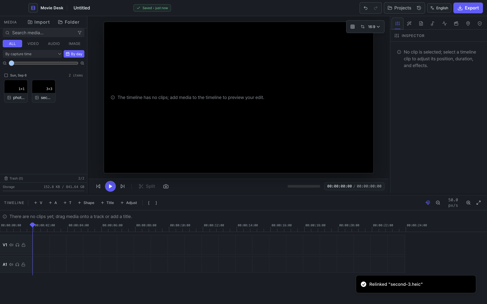

## 남은 릴리스 확인

물리 USB 분리 및 서명된 RC DMG 확인은 조정자 승인에 따라 `docs/09-release-checklist.md` §3에 남겼다. 임시 이미지 볼륨 실기를 물리 USB 확인으로 간주하지 않는다. 영상·오디오 원본의 폭넓은 컨테이너/코덱 실기와 대형 미디어 재연결은 릴리스 환경에서 추가 확인한다; 이 실기는 현재 실제 desktop 참조 importer의 HEIC 경로에 집중했다.

## 테스트 환경 정리

전용 볼륨은 최종 SHA-256 검사를 위해 read-only로 연결한 뒤 해제했다. 테스트 Electron 프로세스와 전용 웹 서버를 종료하고 `/tmp/movie-desk-a4.M6Cyqq/`의 sparse image·프로필·사본을 삭제했다. `/Volumes/MovieDeskA4Test`가 남지 않은 것을 확인했으며, 사용자 드라이브와 실제 앱 프로필은 변경하지 않았다.

## a921ae1 리뷰 반영

- 일괄 행별 체크박스: identical만 기본 선택하며 확인 버튼은 선택한 행에만 동작한다. fingerprint/size는 사용자가 선택해야 `confirmed=true`가 전달된다.
- 폴더 준비: 볼륨 조회 1회, inspect와 size/mtime/quick hash로 준비, 진행률 이벤트, 취소 토큰, 2분 상한, 1,000개 초과 안내. 전체 hash는 커밋에서만 읽고 TOCTOU 재검사를 유지한다.
- 취소는 준비 작업과 해당 sender의 미사용 토큰을 폐기한다. 이미 실행 중인 helper 요청의 응답은 버리고 후속 작업은 시작하지 않는다.
- 실패 행은 종류/지원 형식/디코드/폴더 이탈/접근 실패를 구분하며 실제·예상 크기를 표시한다. pending 2,000개 상한은 별도 안내한다.
- 30초 자동 프로브는 disk 부분집합만 검사하고 prune을 호출하지 않는다. 자산 목록은 ref로 읽으며 숨겨진 창은 건너뛴다. offline 시 다른 볼륨의 캐시는 유지한다.
- schema v2를 유지한다. 마지막 상태를 worker에서 읽어 첫 프로브 전 표시에 사용하되 캐시 시각은 무효화하여 새 프로브를 반드시 수행한다. 같은 상태의 반복 쓰기는 생략한다.
- 백업 변경 판정은 worker connection의 `total_changes()`와 `data_version`을 함께 사용한다. 자신의 쓰기를 감지하지 못하는 `data_version` 단독 판정을 피한다. 재실행 뒤 첫 백업은 한 번 생성한다.
- 종료 snapshot/close/helper close는 4초 상한을 공유한다. 주기 백업 3회 연속 실패 시 세션당 한 번 안내하고, 복원 실패 후에는 이전 카탈로그를 다시 열도록 재시작한다.
- 동일 파일 재연결의 미계산 hash는 기존 값을 보존한다. 카탈로그 재검사는 명시적 필드 비교를 사용하고 루트 비교는 양쪽 realpath를 사용한다.
- 추가 회귀: 15분 토큰 만료, 카탈로그 변경 거부, pending 상한/취소, full+quick 보존, 준비 단계 full hash 금지, 백업 변경 생략·세대 보존, 채워진 v1 DB의 반복 마이그레이션, 일괄 기본 선택 순수 함수와 실제 브라우저 대화상자.

### 리뷰 후 Electron 재확인

2026-09-06, 동일한 Electron 43.1.1과 production renderer를 `/tmp/movie-desk-a4-review.8QXPPU/`의 격리 appData/userData로 실행했다. 테스트용 HEIC는 저장소 아이콘을 sips로 변환해 만들었으며 사용자 미디어나 볼륨은 변경하지 않았다.

| 확인 | 결과 |
| --- | --- |
| 실제 HEIC 참조 가져오기 → 테스트 파일 위치 변경 → 누락 표시 | PASS |
| 실제 macOS 폴더 chooser에서 후보 폴더 지정 | PASS (Computer Use) |
| 동일 지문 기본 체크와 예상/실제 크기 표시 → 선택 행 연결 | PASS (실제 helper·카탈로그·IPC 사용) |
| 원본/후보 SHA-256 보존 | 둘 다 `c42c561dad05b193e2a1cf8ce67c2f6537f92b8698ae4c4c5cdfd01fb3a3262e` |
| 응답하지 않는 snapshot을 격리 프로세스에 주입 → 종료 | 프로세스 종료까지 4,162ms (4초 대기 상한 + OS 종료 시간) |
| 응답하지 않는 fingerprint를 격리 프로세스에 주입 → 진행률 UI의 취소 | 최종 UI에서 45ms 뒤 진행 UI가 닫히고 후보 연결 없이 종료 |

취소 시험에서만 chooser 결과를 전용 테스트 폴더로 대체했다. 네이티브 폴더 선택은 앞선 실제 연결 시험에서 별도로 수행했다. 물리 USB 분리·복귀와 서명된 RC DMG 검증은 릴리스 §3에 남아 있으며, a921ae1의 전용 APFS 이미지 분리·복귀 기록은 위 최초 실기 결과를 유지한다.

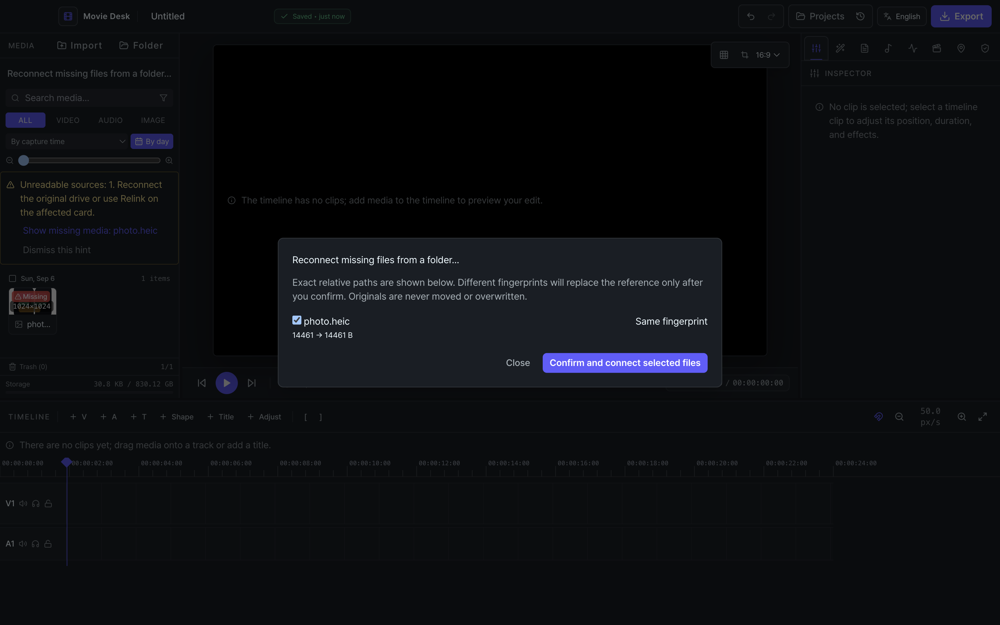
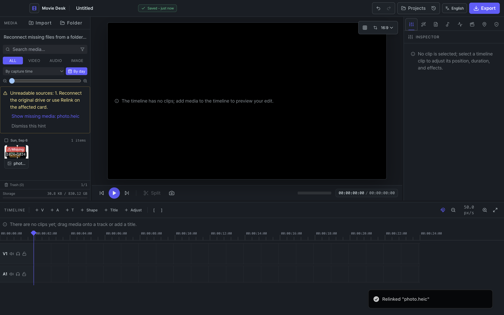
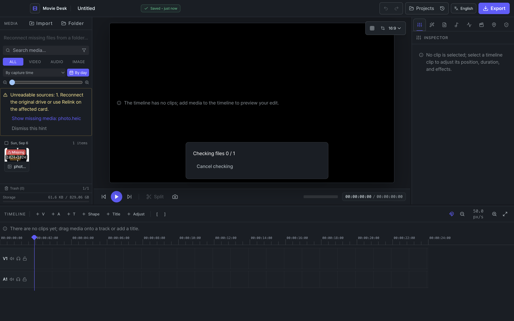

실기 종료 후 전용 Electron 프로세스와 production server를 종료하고 `/tmp/movie-desk-a4-review.8QXPPU/`를 정리했다. 최종 gate: 데스크톱 72, 렌더러 506, Core 107, scripts 11, 웹 e2e 49개 모두 PASS.
