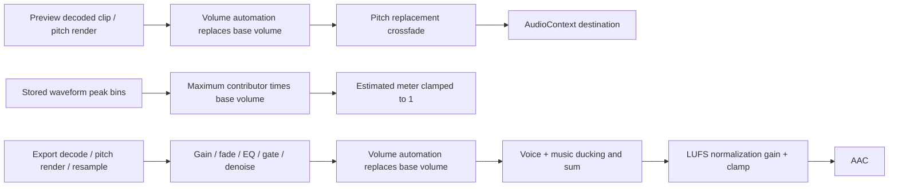

# B′3 audio bus audit — 2026-09-07

Baseline: fetched `origin/main`, verified `1c3c0e4`. No user media or external drives used.

## Existing signal paths

Preview and export skip muted tracks and non-solo tracks when any solo exists. The old waveform meter only skips muted tracks: it ignores solo, disabled clips, volume automation, effects, and phase. It uses maximum, not the summed signal. Preview currently omits the export effect chain and ducking/normalization; B′3 routing parity does not imply those pre-existing paths are equivalent.

## Baseline numerical reproduction

Deterministic project fixture: 48 kHz, 1 second, 1 kHz sine, amplitude 0.6; two overlapping audio tracks with unity clips and waveform peaks 0.6. Node Float32 synthesis and explicit PCM summation, not a microphone recording. “Actual” below means PCM sample measurement before output conversion, not the original UI meter.

| Same fixture, track selection/phase | Waveform estimate | PCM peak | PCM RMS | Samples > 1 per channel |
| --- | ---: | ---: | ---: | ---: |
| One audible sine | 0.6 | 0.600000024 | 0.424264072 | 0 |
| Two equal-phase sines | 0.6 | 1.200000048 | 0.848528144 | 18000 |
| Second sine phase inverted | 0.6 | 0 | 0 | 0 |

The overlapping signal is 6.0206 dB higher than the estimate; cancellation is entirely invisible to waveform peaks. These are sample peaks, not oversampled true peaks.

## Acceptance scope

- Additive track gain/pan/bus assignment and project buses/master, with validated JSON and CRDT round trips.
- Shared routing policy, muted/solo behavior and deleted-bus master fallback.
- Live track/bus/master peak and RMS, 1.5 second hold, clipping, source labels; estimated stopped/scrub meter retained.
- Four-times oversampled approximate true peak and pre-clamp clipped sample counts after normalization.
- Precision gesture undo, bus deletion cleanup, mobile horizontal scrolling and accessible controls.
- Browser OfflineAudioContext parity against export PCM, <= 1 ms live meter frame cost at eight tracks, and existing 1,000-asset benchmark.
- Full release gate and final measurements are recorded below.

## Implemented routing and meter evidence

`node scripts/audio-routing-benchmark.mjs docs/evaluations/2026-09-07-audio-routing-measurements.json` builds the actual preview graph and export mixer, runs real browser OfflineAudioContext renders, and compares mono/stereo at five pan positions. Maximum absolute PCM difference: **1.49e-8** with clip 0.5, track −6 dB, bus −3 dB and master +2 dB. This is below ±1e-4. It does not claim parity for existing export-only effects, ducking, limiting, normalization or pitch-rate interpolation.

Eight-track metering: all worklet message handlers (including master) plus one actual Zustand publication, 1,000 iterations: maximum **0.10 ms**, median/p95 below browser timer resolution. This explicitly excludes React layout/paint. Worklet DSP measures every render sample and emits once per 2,048 frames; main publishes at most once per rAF. AudioWorklet tests verify pass-through, opposite-phase peaks, isolated overloaded samples, and contiguous 3-second LUFS at 44.1/48 kHz. Pure tests verify silence, sine RMS, 1.5-second hold, normalization clipping and chunk-invariant oversampled inter-sample peaks.

Playwright: UI −6 dB gain yields an export PCM RMS ratio of **0.501187** (−6.000 dB), a single undo restores zero, live master produces measured values, and routed bus mute yields exact zero PCM. This tests the actual export PCM stage with persisted UI edits and imported local WAV; it does not depend on Chromium having an AAC encoder. Bus/master-only changes now trigger both Yjs and library snapshot persistence. A master-only precision gesture flushes once. JSON export envelope and Yjs update round trips preserve routing.

Screenshots: [desktop](audio-bus/desktop.png), [390px mobile horizontal scroll](audio-bus/mobile.png). Stopped estimates now respect track gain/pan/solo, bus mute/gain and master gain while retaining their maximum-envelope, phase-blind basis. They still do not estimate clip effects or true peak.

## 1,000-asset regression run

Current run: `node apps/web/scripts/bench-library.mjs --assets 1000 --videos 200 --url http://127.0.0.1:32120 --out docs/evaluations/2026-09-07-audio-bus-library-1000.json` against an isolated dev server and fresh Chrome profile. Repository synthetic media only.

| Metric | Prior C3 off run | B′3 |
| --- | ---: | ---: |
| Import | 7444 ms | 7392 ms |
| Search median | 13.8 ms | 14.1 ms |
| Filter median | 11.4 ms | 13.6 ms |
| Grid ready p95 | 368 ms | 375 ms |
| Background settle p95 | 1965 ms | 1965 ms |
| DOM cards | 16 | 16 |
| Project JSON | 244659 bytes | 244659 bytes |
| Uncollected JS heap after import/reload | 48.2 / 60.6 MB | 64.5 / 107.3 MB |

Latency remains within the existing search/filter <100 ms and grid-ready <400 ms targets. Raw heap readings are higher and are not proof of a retained-memory regression; the paired baseline check below resolves the apparent reload-heap increase. Do not interpret uncollected heap as retained memory.

The 1,000-assets/1,000-clips precision flush test measured 60 frames at p95 0.053 ms with one final flush (1.72 ms), versus ungated p95 1.89 ms and 60 flushes.

## Gate status

The initial gate stopped at two B′2 AudioContext mocks missing the new graph API. On 2026-09-07 the coordinator authorized edits to `pitch-invalidation.test.ts` and `pitch-preview-jobs.test.ts`; both now provide `createStereoPanner`, disconnect support and inert frame scheduling while running the actual MixerAudioGraph. Their decode replacement/job cancellation assertions remain unchanged. No implementation under `core/src/audio` or `web/src/audio` was changed, and the alternative whole-graph mock patch was not used.

### Paired baseline check

A plain temporary `git archive 1c3c0e4` snapshot (not another worktree), offline frozen-lockfile install, isolated dev server and the same benchmark script produced [baseline JSON](2026-09-07-audio-bus-baseline-1000.json). The temporary server was stopped after the run.

| Metric | 1c3c0e4 paired baseline | B′3 |
| --- | ---: | ---: |
| Import | 7451 ms | 7392 ms |
| Search / filter median | 13 / 12 ms | 14 / 14 ms |
| Grid-ready p95 | 373 ms | 375 ms |
| Background settle p95 | 1938 ms | 1965 ms |
| Heap after import / reload | 58.9 / 111.2 MB | 64.5 / 107.3 MB |
| DOM cards / project JSON | 16 / 244659 bytes | 16 / 244659 bytes |

No latency-budget or post-reload heap regression observed. These are single paired development-server runs; GC is not forced. Live mixer components also avoid subscribing to playhead ticks while playing, and master waveform requests are retained outside project persistence.

Independent integration gate: **4/4 PASS**, OSV audit, production build, Chromium install and **59/59 E2E**. The resumed full gate is recorded in [the final gate report](2026-09-07-audio-bus-gate.md).

## Resumed dispatch completion

Coordinator approval retains explicit stereo upmix and the same stereo crossfeed law in preview/export, preserving legacy center gain. Limiter and normalization defaults remain unchanged; pre-limiter overload and normalized pre-clamp approximate true peak are separate diagnostics. The unused proposed graph-mock patch is excluded from the commit.

Full `pnpm gate` result: **9/9 PASS**, unit tests **847** (core 143, web 621, desktop 72, scripts 11), Chromium E2E **59/59 PASS**. Port 32119 was free before launch, and no concurrent release gate was running. The implementation, targeted mock compatibility fixes, numerical evidence and documentation form one integrated audio-bus feature commit. No push/main merge, other worktree modifications, user media access or dependency changes are part of this task.
